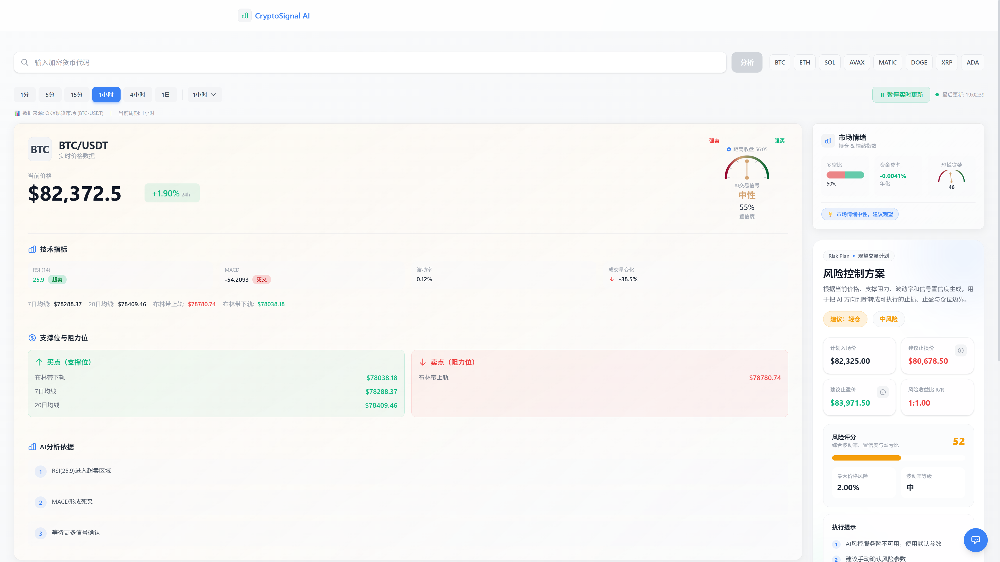
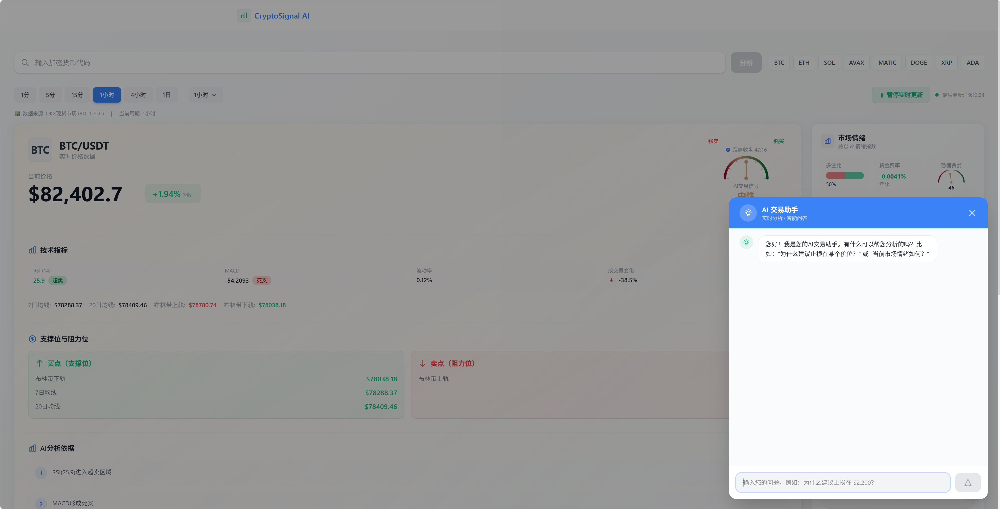

# CryptoSignal AI - 加密货币实时交易分析系统

基于 OKX 交易所数据的 AI 驱动加密货币交易分析系统，提供实时价格更新、技术指标分析和智能交易信号。

## 功能特性

- **实时价格更新** - 通过 WebSocket 连接 OKX 实时行情接口
- **技术指标分析** - RSI、MACD、布林带、均线等多种指标
- **AI 交易信号** - 基于大模型的智能买卖建议
- **多时间周期** - 支持 1秒到3月等多种周期切换
- **响应式设计** - 适配桌面和移动设备

## 预览效果

### 主界面


### AI 交易助手


## 技术栈

### 前端
- **框架**: Next.js 14
- **语言**: TypeScript
- **样式**: TailwindCSS 3
- **图标**: Lucide React

### 后端
- **框架**: FastAPI
- **语言**: Python 3.10+
- **数据来源**: OKX API / WebSocket
- **大模型**: 智谱 GLM-4.5-Flash

## 项目结构

```
okx-trade-agent/
├── agent/                    # 后端服务
│   ├── services/             # 核心服务
│   │   ├── llm_service.py    # 大模型服务
│   │   ├── market_provider.py # 市场数据抽象
│   │   ├── okx_service.py    # OKX API 服务
│   │   ├── websocket_provider.py # WebSocket 实时数据
│   │   └── provider_factory.py # 数据提供者工厂
│   ├── tools/                # 工具函数
│   ├── agent.py              # 核心业务逻辑
│   ├── main.py               # FastAPI 入口
│   └── requirements.txt      # Python 依赖
├── frontend/                 # 前端应用
│   ├── components/           # React 组件
│   │   ├── SignalCard.tsx    # 信号卡片组件
│   │   └── SearchBar.tsx     # 搜索栏组件
│   ├── pages/                # 页面路由
│   ├── services/             # API 服务
│   └── package.json          # Node.js 依赖
└── README.md                 # 项目说明
```

## 快速开始

### 前置条件

- Python 3.10+
- Node.js 18+
- OKX API Key（可选，用于私有 API）

### 环境变量配置

在 `agent/.env` 文件中配置以下环境变量：

```bash
# 大模型配置
ANTHROPIC_BASE_URL=https://open.bigmodel.cn/api/anthropic
ANTHROPIC_MODEL=glm-4.5-flash
ANTHROPIC_API_KEY=your_api_key_here

# 数据获取模式: http, ws, mcp
OKX_PROVIDER_TYPE=http

# OKX API 配置（可选）
OKX_API_KEY=your_okx_api_key
OKX_SECRET_KEY=your_okx_secret_key
OKX_PASSPHRASE=your_okx_passphrase
```

### 启动服务

#### 1. 启动后端服务

```bash
cd agent
pip install -r requirements.txt
python main.py
```

服务将运行在 `http://localhost:8000`

#### 2. 启动前端服务

```bash
cd frontend
npm install
npm run dev
```

前端将运行在 `http://localhost:3000`（或自动分配的其他端口）

### API 接口

#### 获取加密货币分析

**POST** `/api/v1/analysis`

请求体：
```json
{
  "input": "BTC",
  "timeframe": "1H"
}
```

响应示例：
```json
{
  "symbol": "BTC",
  "price": 77234.56,
  "change24h": 2.34,
  "signal": "BUY",
  "confidence": 0.78,
  "reason": ["RSI 处于超卖区域", "MACD 形成金叉"],
  "indicators": {
    "rsi": 28.93,
    "macd": -186.25,
    "bollinger_lower": 77060.04,
    "bollinger_upper": 78520.34
  }
}
```

### 支持的时间周期

| 周期 | 值 |
|------|-----|
| 1秒 | 1s |
| 1分钟 | 1m |
| 3分钟 | 3m |
| 5分钟 | 5m |
| 15分钟 | 15m |
| 30分钟 | 30m |
| 1小时 | 1H |
| 2小时 | 2H |
| 4小时 | 4H |
| 6小时 | 6H |
| 12小时 | 12H |
| 1日 | 1D |
| 2日 | 2D |
| 3日 | 3D |
| 5日 | 5D |
| 1周 | 1W |
| 1月 | 1M |
| 3月 | 3M |

## 技术指标说明

### RSI (相对强弱指数)
- RSI < 30: 超卖区域，可能是买入信号
- RSI > 70: 超买区域，可能是卖出信号

### MACD (指数平滑异同移动平均线)
- MACD 线穿越信号线向上（金叉）: 买入信号
- MACD 线穿越信号线向下（死叉）: 卖出信号

### 布林带
- 价格触及下轨: 可能反弹，买入信号
- 价格触及上轨: 可能回落，卖出信号

### 均线
- 价格站上短期均线: 买入信号
- 价格跌破短期均线: 卖出信号

## 数据来源

当前系统使用 **OKX 现货市场** 数据（如 BTC-USDT）。如需切换到合约数据，请修改 `agent/services/market_provider.py` 中的交易对格式。

## 注意事项

1. **风险提示**: 本系统仅供参考，不构成投资建议。加密货币交易风险极高，请谨慎投资。
2. **API 限制**: OKX 公开 API 有请求频率限制，请合理控制调用频率。
3. **网络延迟**: 实时数据可能存在轻微延迟，请以交易所实际数据为准。

## License

MIT License
